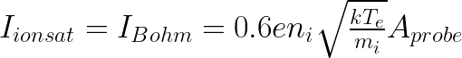
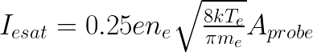

---
​---
title: Live Share
permalink: /MLM-IV/MLM-IV-Analysis/
​---

---

# MLM-IV-ANALYSIS

[**INDEX**](index.md)

MLM-IV-Analysis, loads a NPY data file from MLM-IV-SimPlot and performs following plots, fits, and analysis:

The analysis provides four sub-plots:

1. IV Curve

   

2. Derivative of IV Curve, and peak finding for estimation of the plasma potential **Vp**

   

3. Ion Saturation Fit, where we fit a linear curve to the ion saturation current

   

4. Subtraction of the Ion Saturation Current from the IV curve, and plotting the resulting data transformed by Ln(y), and fit the electron retardation zone and the electron saturation zone. The slope of the electron retardation zone gives the electron temperature Te, in eV, the crossing point between the two fits is the plasma potential  Vp which in most cases is a better estimated value compared to the value achieved by the peak of the derivative of the IV curve.

   

Output plot by [**MLM-IV-ANALYSIS**](MLM-IV-Analysis.md) : Langmuir Probe Analysis with Fits and Intersections

 <a href="images/MLM-IV-Analysis.png" onclick="window.open(this.href, 'popup', 'width=600,height=600'); return false;">Open image</a>


We use equation 3 from Merlino 2007 to find ion density **ni** since we have fitted the ion saturation current, and since we can find **Te** from the LN(I) transformation from the slope of the line in electron retardation zone. 

<p align="center">    </p>

We use equation 6 from Merlino 2007 to to to find electron density **ne** since we have fitted the electron saturation current, and since we can find **Te** from the LN(I) transformation from the slope of the line in electron retardation zone. 

<p align="center">    </p>

Notes about calculation (example calculation in preparation, key is to use **Te** in Kelvin and not in eV)

The debug output gives following

```python
Estimated Electron Temperature (Te)	= 1.89 eV
Estimated Plasma Potential (Vp) = 4.46 V (derivative peak)
Estimated Plasma Potential (Vp) = 5.42 V (line crossing)
Estimated Electron Saturation Current (Ie_sat)	= 2.30e-03 A
Estimated Ion Saturation Current (Ii_sat) = -9.31e-05 A
Estimated Electron Density (ne) = 8.83e+15 m^-3 (calculated using thermal velocity)
Estimated Ion Density (ni) = 1.02e+16 m^-3

Original simulation values was:
Te = 2.0 eV
ne = 1E16 m-3
ni = 1E16 m-3
Vp = 5.68 (theoretical curve)

```


