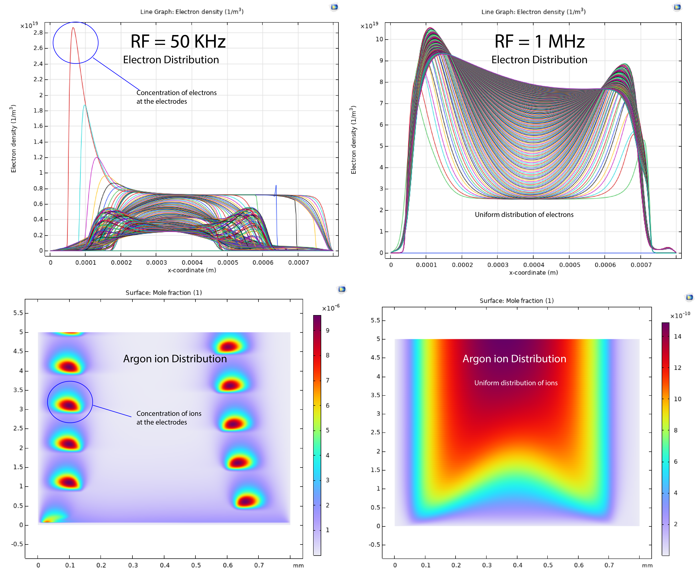

[[Welcome]]

There is text there as well

``` python
# ------------------ Constants ------------------
e = 1.602e-19  # Elementary charge in C
kb = 1.38e-23  # Boltzmann constant in J/K
me = 9.11e-31  # Electron mass in kg
mi = 1.67e-27  # Ion mass (proton) in kg
ProbeDia = 3e-3  # Probe diameter in m
Aprobe = np.pi * (ProbeDia / 2) ** 2
ne = 1e16
ni = 1e16
Tp = 0.03
V_min = -20
V_max = 20
V_points = 1000
V_range = np.linspace(V_min, V_max, V_points)
```
$$(\omega_p = \sqrt{\frac{n_e e^2}{\varepsilon_0 m_e}} )$$

$$
f(x) = \int_{-\infty}^\infty \hat f(\xi)\,e^{2 \pi \xi x} \,d\xi
$$

---

Here is some additional text

# Thats a heading
- [ ] this have to be done
- [x] this is already done


**The Cauchy-Schwarz Inequality**

```math
\left( \sum_{k=1}^n a_k b_k \right)^2 \leq \left( \sum_{k=1}^n a_k^2 \right) \left( \sum_{k=1}^n b_k^2 \right)
```

$`\sqrt{\$4}`$

$`\sqrt{3}`$
